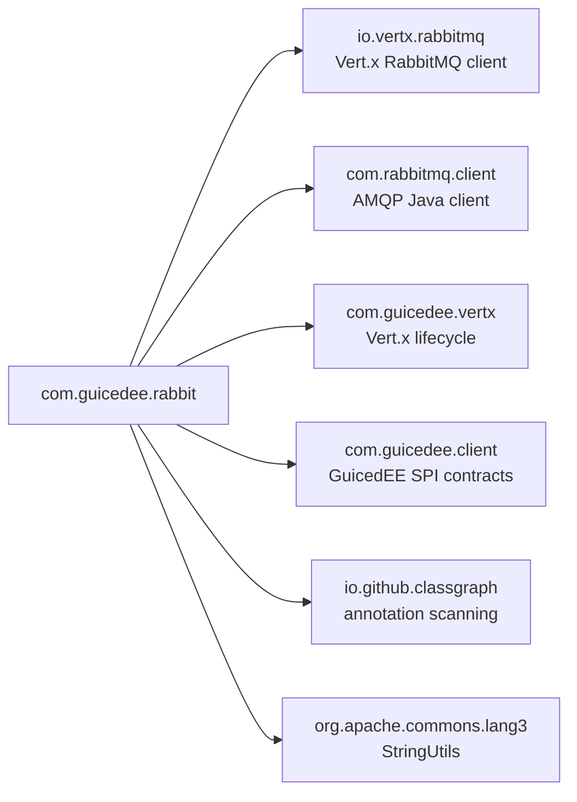

# GuicedEE RabbitMQ

[](https://github.com/GuicedEE/RabbitMQ/actions/workflows/build.yml)
[](https://central.sonatype.com/artifact/com.guicedee/rabbitmq)
[](https://github.com/GuicedEE/Packages/packages/maven/com.guicedee.rabbitmq)
[](https://www.apache.org/licenses/LICENSE-2.0)


**Annotation-driven RabbitMQ** integration for the [GuicedEE](https://github.com/GuicedEE) / Vert.x stack.
Declare connections, exchanges, queues, consumers, and publishers with annotations — everything is discovered at startup via ClassGraph, wired through Guice, and managed by the Vert.x RabbitMQ client.

Built on [Vert.x RabbitMQ Client](https://vertx.io/docs/vertx-rabbitmq-client/java/) · [RabbitMQ Java Client](https://www.rabbitmq.com/java-client.html) · [Google Guice](https://github.com/google/guice) · JPMS module `com.guicedee.rabbit` · Java 25+

## 📦 Installation

```xml
<dependency>
  <groupId>com.guicedee</groupId>
  <artifactId>rabbitmq</artifactId>
</dependency>
```

<details>
<summary>Gradle (Kotlin DSL)</summary>

```kotlin
implementation("com.guicedee:rabbitmq:2.0.0-RC11")
```
</details>

## ✨ Features

- **Annotation-driven setup** — `@RabbitConnectionOptions`, `@QueueExchange`, `@QueueDefinition`, and `@QueueOptions` declare the entire topology
- **Auto-discovery** — `RabbitMQPreStartup` scans the classpath via ClassGraph to find all annotated connection, exchange, consumer, and publisher declarations
- **Guice-managed consumers & publishers** — consumer classes are bound as singletons; `QueuePublisher` instances are injectable by `@Named("queue-name")`
- **Exchange management** — exchanges are declared automatically with configurable type (Direct, Fanout, Topic, Headers), durability, auto-delete, and optional dead-letter exchange
- **Queue options** — priority, prefetch count, TTL, durability, auto-ack, single-consumer mode, exclusive, transacted, auto-bind, consumer count, dedicated channel/connection
- **Publisher confirms** — optional per-connection `confirmPublishes` with `waitForConfirms()` after each publish
- **Environment variable overrides** — every annotation attribute can be overridden via system properties or environment variables at runtime, scoped by name (see [Environment Variable Overrides](#-environment-variable-overrides))
- **SPI callback** — implement `OnQueueExchangeDeclared` to perform custom work after an exchange is declared

## 🚀 Quick Start

**Step 1** — Define a connection and exchange. Place `@RabbitConnectionOptions` on a class or `package-info.java`. If placed inside a `@Verticle`-annotated package, the connection is managed by that verticle; otherwise it falls into the default verticle. Add `@QueueExchange` on a class or `package-info.java` in the same (or sub-) package:

```java
@Verticle
@RabbitConnectionOptions(
        value = "my-connection",
        host = "localhost",
        user = "guest",
        password = "guest"
)
@QueueExchange(
        value = "my-exchange",
        exchangeType = QueueExchange.ExchangeType.Direct,
        durable = true
)
package com.example.messaging;

import com.guicedee.vertx.spi.Verticle;
```

Or without `@Verticle` (uses the default verticle):

```java
@RabbitConnectionOptions(
    value = "my-connection",
    host = "localhost",
    user = "guest",
    password = "guest"
)
@QueueExchange(
    value = "my-exchange",
    exchangeType = QueueExchange.ExchangeType.Direct,
    durable = true
)
public class MessagingConfig {
}
```

**Step 2** — Create a consumer:

```java
@QueueDefinition("order-events")
public class OrderConsumer implements QueueConsumer {
    @Override
    public void consume(RabbitMQMessage message) {
        System.out.println("Received: " + message.body());
    }
}
```

**Step 3** — Inject a publisher:

```java
public class OrderService {

    @Inject
    @Named("order-events")
    private QueuePublisher orderPublisher;

    public void placeOrder(String orderJson) {
        orderPublisher.publish(orderJson);
    }
}
```

**Step 4** — Bootstrap GuicedEE:

```java
IGuiceContext.instance().inject();
```

That's it. `RabbitMQPreStartup` discovers the annotations, `RabbitMQModule` creates the Guice bindings, and `RabbitPostStartup` declares exchanges/queues and starts consumers automatically.

## 📐 Architecture

```mermaid
flowchart TD
    n1["Startup"]
    n2["IGuiceContext.instance()"]
    n1 --> n2
    n3["RabbitMQPreStartup<br/>IGuicePreStartup — annotation scanning"]
    n2 --> n3
    n4["Discovers @RabbitConnectionOptions classes"]
    n3 --> n4
    n5["Discovers @QueueExchange classes per package"]
    n3 --> n5
    n6["Discovers @QueueDefinition consumer classes"]
    n3 --> n6
    n7["Discovers @QueueDefinition/@QueuePublisher fields"]
    n3 --> n7
    n8["Registers metadata for binding"]
    n3 --> n8
    n9["RabbitMQModule<br/>IGuiceModule — Guice bindings"]
    n2 --> n9
    n10["Creates RabbitMQClient per connection<br/>via Vert.x"]
    n9 --> n10
    n11["Binds RabbitMQClient as @Named('connection-name')"]
    n9 --> n11
    n12["Binds QueueConsumer implementations as singletons"]
    n9 --> n12
    n13["Binds QueuePublisher instances as @Named('queue-name')"]
    n9 --> n13
    n14["Binds RabbitMQClient as @Named('connection-name')"]
    n9 --> n14
    n15["RabbitPostStartup<br/>IGuicePostStartup — runtime initialization"]
    n2 --> n15
    n16["Starts RabbitMQ client connections"]
    n15 --> n16
    n17["Declares exchanges<br/>with optional DLX"]
    n15 --> n17
    n18["Declares queues with options<br/>priority, TTL, etc."]
    n15 --> n18
    n19["Binds queues to exchanges with routing keys"]
    n15 --> n19
    n20["Enables publisher confirms if configured"]
    n15 --> n20
    n21["Starts consumer listeners"]
    n15 --> n21
```



### Message lifecycle

```
Publish:
  QueuePublisher.publish(body)
   → AMQP.BasicProperties (priority, etc.)
   → RabbitMQClient.basicPublish(exchange, routingKey, buffer)
   → [optional] client.waitForConfirms()

Consume:
  RabbitMQ broker delivers message
   → RabbitMQConsumer handler
     → CallScoper transaction boundary
       → QueueConsumer.consume(message)       ← Guice-managed instance
```

## 🔧 Annotations

### `@RabbitConnectionOptions`

Placed on a class or `package-info.java` to declare a RabbitMQ connection. Optionally within a `@Verticle` package for dedicated verticle management; otherwise uses the default verticle:

| Attribute | Default | Purpose |
|---|---|---|
| `value` | `"default"` | Connection name (used for `@Named` binding) |
| `uri` | `""` | Connection URI (takes precedence over host/port) |
| `host` | `""` | Broker hostname |
| `port` | `0` | Broker port (0 = default 5672) |
| `user` | `"guest"` | Username |
| `password` | `"guest"` | Password |
| `virtualHost` | `""` | Virtual host |
| `addresses` | `{}` | Clustered broker addresses |
| `connectionTimeout` | `0` | Connection timeout (ms) |
| `requestedHeartbeat` | `0` | Heartbeat interval (s) |
| `handshakeTimeout` | `0` | Handshake timeout (ms) |
| `requestedChannelMax` | `0` | Max channels |
| `networkRecoveryInterval` | `0` | Recovery interval (ms) |
| `automaticRecoveryEnabled` | `true` | Enable automatic recovery |
| `automaticRecoveryOnInitialConnection` | `false` | Recover on initial connect failure |
| `reconnectAttempts` | `0` | Vert.x reconnect attempts |
| `reconnectInterval` | `0` | Vert.x reconnect interval (ms) |
| `useNio` | `false` | Use NIO connections |
| `confirmPublishes` | `false` | Enable publisher confirms |

### `@QueueExchange`

Placed on a class or `package-info.java` to declare an AMQP exchange:

| Attribute | Default | Purpose |
|---|---|---|
| `value` | `"default"` | Exchange name |
| `exchangeType` | `Direct` | Exchange type: `Direct`, `Fanout`, `Topic`, `Headers` |
| `durable` | `false` | Survive broker restarts |
| `autoDelete` | `false` | Delete when last consumer disconnects |
| `createDeadLetter` | `false` | Create a companion `.DLX` exchange and queue |

### `@QueueDefinition`

Placed on a `QueueConsumer` class or a `QueuePublisher` field:

| Attribute | Default | Purpose |
|---|---|---|
| `value` | — | Queue name (required) |
| `options` | `@QueueOptions` | Queue-level options |
| `exchange` | `"default"` | Exchange to bind to (or `"default"` for the package exchange) |

### `@QueueOptions`

Nested within `@QueueDefinition` to configure queue behavior:

| Attribute | Default | Purpose |
|---|---|---|
| `priority` | `0` | Max priority level (0 disables) |
| `fetchCount` | `0` | Consumer prefetch count |
| `durable` | `false` | Queue survives broker restarts |
| `delete` | `false` | Auto-delete when last consumer disconnects |
| `autoAck` | `false` | Auto-acknowledge messages |
| `consumerExclusive` | `false` | Exclusive to the declaring connection |
| `singleConsumer` | `false` | Enforce single active consumer |
| `ttl` | `0` | Message time-to-live (ms, 0 disables) |
| `noLocal` | `false` | Don't deliver messages published on same connection |
| `keepMostRecent` | `true` | Keep most recent messages on backlog overflow |
| `maxInternalQueueSize` | `MAX_VALUE` | Client-side consumer buffer size |
| `transacted` | `true` | Wrap consumption in a `CallScoper` transaction boundary |
| `autobind` | `true` | Auto-start consumer on startup |
| `consumerCount` | `1` | Number of consumer instances |
| `dedicatedChannel` | `false` | Use a dedicated channel |
| `dedicatedConnection` | `false` | Use a dedicated connection |

## 📤 Publishing

Inject a `QueuePublisher` by queue name:

```java
@Inject
@Named("order-events")
private QueuePublisher publisher;

public void send() {
    publisher.publish("{\"orderId\": 123}");
}
```

The publisher resolves the exchange and routing key automatically from the queue's `@QueueDefinition`. The routing key follows the pattern `{exchangeName}_{queueName}`.

### Field-level `@QueueDefinition` on publishers

A `QueuePublisher` injection point can optionally carry `@QueueDefinition` to override the exchange or options for that specific publisher. This is useful when publishing to a queue that belongs to a different exchange than the package default:

```java
@Inject
@Named("cross-exchange-queue")
@QueueDefinition(value = "cross-exchange-queue", exchange = "other-exchange",
    options = @QueueOptions(priority = 5))
private QueuePublisher crossExchangePublisher;
```

When `@QueueDefinition` is present on the field and specifies an `exchange` other than `"default"`, that exchange is used instead of the package-level exchange. If `@QueueDefinition` is absent, the queue name is resolved from the `@Named` value and the package exchange is used.

### Publisher confirms

Enable per-connection with `@RabbitConnectionOptions(confirmPublishes = true)`. The publisher will call `client.waitForConfirms()` after each publish and log the result.

## 📥 Consuming

Implement `QueueConsumer` and annotate with `@QueueDefinition`:

```java
@QueueDefinition(value = "notifications",
    options = @QueueOptions(durable = true, autoAck = false, fetchCount = 10))
public class NotificationConsumer implements QueueConsumer {
    @Override
    public void consume(RabbitMQMessage message) {
        // Process the message
        System.out.println(message.body().toString());
    }
}
```

### Single consumer mode

Use `@QueueOptions(singleConsumer = true)` to ensure only one active consumer at a time (uses the `x-single-active-consumer` queue argument).

## ⚙️ Environment Variable Overrides

All annotation attributes can be overridden at runtime via system properties or environment variables. Overrides are **scoped by name** — the lookup tries a name-specific key first, then falls back to a global key:

1. `RABBITMQ_{NORMALIZED_NAME}_{PROPERTY}` — name-specific override
2. `RABBITMQ_{PROPERTY}` — global fallback
3. Annotation default

The name is normalized to uppercase with hyphens and dots replaced by underscores. For example, a connection named `order-service` checking the `HOST` property would resolve:
1. `RABBITMQ_ORDER_SERVICE_HOST` (name-specific)
2. `RABBITMQ_HOST` (global fallback)
3. The `host` attribute from the `@RabbitConnectionOptions` annotation

### Connection overrides (`@RabbitConnectionOptions`)

Scoped by the connection `value()` name:

| Property | Variable pattern |
|---|---|
| `value()` | `RABBITMQ_{name}_CONNECTION_NAME` / `RABBITMQ_CONNECTION_NAME` |
| `uri()` | `RABBITMQ_{name}_URI` / `RABBITMQ_URI` |
| `host()` | `RABBITMQ_{name}_HOST` / `RABBITMQ_HOST` |
| `port()` | `RABBITMQ_{name}_PORT` / `RABBITMQ_PORT` |
| `user()` | `RABBITMQ_{name}_USER` / `RABBITMQ_USER` |
| `password()` | `RABBITMQ_{name}_PASSWORD` / `RABBITMQ_PASSWORD` |
| `virtualHost()` | `RABBITMQ_{name}_VIRTUAL_HOST` / `RABBITMQ_VIRTUAL_HOST` |
| `addresses()` | `RABBITMQ_{name}_ADDRESSES` / `RABBITMQ_ADDRESSES` |
| `connectionTimeout()` | `RABBITMQ_{name}_CONNECTION_TIMEOUT` / `RABBITMQ_CONNECTION_TIMEOUT` |
| `requestedHeartbeat()` | `RABBITMQ_{name}_REQUESTED_HEARTBEAT` / `RABBITMQ_REQUESTED_HEARTBEAT` |
| `handshakeTimeout()` | `RABBITMQ_{name}_HANDSHAKE_TIMEOUT` / `RABBITMQ_HANDSHAKE_TIMEOUT` |
| `requestedChannelMax()` | `RABBITMQ_{name}_REQUESTED_CHANNEL_MAX` / `RABBITMQ_REQUESTED_CHANNEL_MAX` |
| `networkRecoveryInterval()` | `RABBITMQ_{name}_NETWORK_RECOVERY_INTERVAL` / `RABBITMQ_NETWORK_RECOVERY_INTERVAL` |
| `automaticRecoveryEnabled()` | `RABBITMQ_{name}_AUTOMATIC_RECOVERY_ENABLED` / `RABBITMQ_AUTOMATIC_RECOVERY_ENABLED` |
| `automaticRecoveryOnInitialConnection()` | `RABBITMQ_{name}_AUTOMATIC_RECOVERY_ON_INITIAL_CONNECTION` / `RABBITMQ_AUTOMATIC_RECOVERY_ON_INITIAL_CONNECTION` |
| `reconnectAttempts()` | `RABBITMQ_{name}_RECONNECT_ATTEMPTS` / `RABBITMQ_RECONNECT_ATTEMPTS` |
| `reconnectInterval()` | `RABBITMQ_{name}_RECONNECT_INTERVAL` / `RABBITMQ_RECONNECT_INTERVAL` |
| `useNio()` | `RABBITMQ_{name}_USE_NIO` / `RABBITMQ_USE_NIO` |
| `confirmPublishes()` | `RABBITMQ_{name}_CONFIRM_PUBLISHES` / `RABBITMQ_CONFIRM_PUBLISHES` |
| `registerWriteHandler()` | `RABBITMQ_{name}_REGISTER_WRITE_HANDLER` / `RABBITMQ_REGISTER_WRITE_HANDLER` |

### Exchange overrides (`@QueueExchange`)

Scoped by the exchange `value()` name:

| Property | Variable pattern |
|---|---|
| `value()` | `RABBITMQ_{name}_EXCHANGE_NAME` / `RABBITMQ_EXCHANGE_NAME` |
| `exchangeType()` | `RABBITMQ_{name}_EXCHANGE_TYPE` / `RABBITMQ_EXCHANGE_TYPE` |
| `durable()` | `RABBITMQ_{name}_EXCHANGE_DURABLE` / `RABBITMQ_EXCHANGE_DURABLE` |
| `autoDelete()` | `RABBITMQ_{name}_EXCHANGE_AUTO_DELETE` / `RABBITMQ_EXCHANGE_AUTO_DELETE` |
| `createDeadLetter()` | `RABBITMQ_{name}_EXCHANGE_CREATE_DEAD_LETTER` / `RABBITMQ_EXCHANGE_CREATE_DEAD_LETTER` |

### Queue overrides (`@QueueDefinition`)

Scoped by the queue `value()` name:

| Property | Variable pattern |
|---|---|
| `value()` | `RABBITMQ_{name}_QUEUE_NAME` / `RABBITMQ_QUEUE_NAME` |
| `exchange()` | `RABBITMQ_{name}_QUEUE_EXCHANGE` / `RABBITMQ_QUEUE_EXCHANGE` |

### Queue options overrides (`@QueueOptions`)

Scoped by the parent queue `value()` name:

| Property | Variable pattern |
|---|---|
| `priority()` | `RABBITMQ_{name}_QUEUE_PRIORITY` / `RABBITMQ_QUEUE_PRIORITY` |
| `fetchCount()` | `RABBITMQ_{name}_QUEUE_FETCH_COUNT` / `RABBITMQ_QUEUE_FETCH_COUNT` |
| `durable()` | `RABBITMQ_{name}_QUEUE_DURABLE` / `RABBITMQ_QUEUE_DURABLE` |
| `delete()` | `RABBITMQ_{name}_QUEUE_DELETE` / `RABBITMQ_QUEUE_DELETE` |
| `autoAck()` | `RABBITMQ_{name}_QUEUE_AUTO_ACK` / `RABBITMQ_QUEUE_AUTO_ACK` |
| `consumerExclusive()` | `RABBITMQ_{name}_QUEUE_CONSUMER_EXCLUSIVE` / `RABBITMQ_QUEUE_CONSUMER_EXCLUSIVE` |
| `singleConsumer()` | `RABBITMQ_{name}_QUEUE_SINGLE_CONSUMER` / `RABBITMQ_QUEUE_SINGLE_CONSUMER` |
| `ttl()` | `RABBITMQ_{name}_QUEUE_TTL` / `RABBITMQ_QUEUE_TTL` |
| `noLocal()` | `RABBITMQ_{name}_QUEUE_NO_LOCAL` / `RABBITMQ_QUEUE_NO_LOCAL` |
| `keepMostRecent()` | `RABBITMQ_{name}_QUEUE_KEEP_MOST_RECENT` / `RABBITMQ_QUEUE_KEEP_MOST_RECENT` |
| `maxInternalQueueSize()` | `RABBITMQ_{name}_QUEUE_MAX_INTERNAL_SIZE` / `RABBITMQ_QUEUE_MAX_INTERNAL_SIZE` |
| `transacted()` | `RABBITMQ_{name}_QUEUE_TRANSACTED` / `RABBITMQ_QUEUE_TRANSACTED` |
| `autobind()` | `RABBITMQ_{name}_QUEUE_AUTOBIND` / `RABBITMQ_QUEUE_AUTOBIND` |
| `consumerCount()` | `RABBITMQ_{name}_QUEUE_CONSUMER_COUNT` / `RABBITMQ_QUEUE_CONSUMER_COUNT` |
| `dedicatedChannel()` | `RABBITMQ_{name}_QUEUE_DEDICATED_CHANNEL` / `RABBITMQ_QUEUE_DEDICATED_CHANNEL` |
| `dedicatedConnection()` | `RABBITMQ_{name}_QUEUE_DEDICATED_CONNECTION` / `RABBITMQ_QUEUE_DEDICATED_CONNECTION` |

### Module-level override

| Variable | Purpose |
|---|---|
| `RABBIT_MQ_PORT` | Global port override applied at the module level (in `RabbitMQModule`) |

## 🔌 SPI & Extension Points

| SPI | Purpose |
|---|---|
| `OnQueueExchangeDeclared` | Callback invoked after an exchange is declared — perform custom work (bind additional queues, etc.) |
| `IGuicePreStartup` | Provided by `RabbitMQPreStartup` — scans for RabbitMQ annotations |
| `IGuiceModule` | Provided by `RabbitMQModule` — binds clients, consumers, publishers |
| `IGuicePostStartup` | Provided by `RabbitPostStartup` — declares exchanges/queues, starts consumers |

### `OnQueueExchangeDeclared`

Implement this SPI to execute custom logic after an exchange has been declared:

```java
public class MyExchangeCallback implements OnQueueExchangeDeclared {
    @Override
    public void perform(RabbitMQClient client, String exchangeName) {
        // Bind additional queues, set policies, etc.
    }
}
```

Register via `module-info.java`:

```java
provides com.guicedee.rabbit.implementations.def.OnQueueExchangeDeclared
    with com.example.MyExchangeCallback;
```

## 💉 Dependency Injection

### Named bindings

| Type | Named by | Example |
|---|---|---|
| `RabbitMQClient` | Connection name | `@Named("my-connection") RabbitMQClient client` |
| `QueuePublisher` | Queue name | `@Named("order-events") QueuePublisher publisher` |
| `QueueConsumer` | Queue name | `@Named("order-events") QueueConsumer consumer` |

### Injecting the RabbitMQ client directly

```java
@Inject
@Named("my-connection")
private RabbitMQClient client;
```

## 🗺️ Module Graph



## 🧩 JPMS

Module name: **`com.guicedee.rabbit`**

The module:
- **exports** `com.guicedee.rabbit`, `com.guicedee.rabbit.implementations.def`, `com.guicedee.rabbit.implementations`
- **uses** `OnQueueExchangeDeclared`
- **provides** `IGuicePostStartup` with `RabbitPostStartup`
- **provides** `IGuiceModule` with `RabbitMQModule`
- **provides** `IGuicePreStartup` with `RabbitMQPreStartup`
- **opens** `com.guicedee.rabbit`, `com.guicedee.rabbit.implementations.def`, `com.guicedee.rabbit.implementations` to `com.google.guice` and `com.fasterxml.jackson.databind`

## 🏗️ Key Classes

| Class | Package | Role |
|---|---|---|
| `RabbitConnectionOptions` | `rabbit` | Annotation declaring a RabbitMQ connection with all AMQP/Vert.x options |
| `QueueExchange` | `rabbit` | Annotation declaring an AMQP exchange (Direct, Fanout, Topic, Headers) |
| `QueueDefinition` | `rabbit` | Annotation declaring a queue name with options and exchange binding |
| `QueueOptions` | `rabbit` | Annotation for queue-level configuration (priority, TTL, durability, etc.) |
| `QueueConsumer` | `rabbit` | Interface for consuming `RabbitMQMessage` instances |
| `QueuePublisher` | `rabbit` | Publishes string payloads to a resolved exchange/routing key |
| `RabbitMQPreStartup` | `implementations` | `IGuicePreStartup` — scans for all RabbitMQ annotations and registers metadata |
| `RabbitMQModule` | `implementations` | `IGuiceModule` — creates clients and binds consumers/publishers in Guice |
| `RabbitPostStartup` | `implementations` | `IGuicePostStartup` — declares exchanges/queues and starts consumers |
| `OnQueueExchangeDeclared` | `implementations.def` | SPI callback invoked after exchange declaration |
| `QueueOptionsDefault` | `implementations.def` | Default mutable implementation of `QueueOptions` for programmatic use |

## 🧪 Testing

The test suite uses [Testcontainers](https://www.testcontainers.org/) to spin up a RabbitMQ broker:

```java
try (var rabbit = new RabbitMQContainer(
        DockerImageName.parse("rabbitmq:3.7.25-management-alpine"))) {
    rabbit.setPortBindings(List.of("5672"));
    rabbit.start();

    IGuiceContext.instance().inject();

    // Publishers are injectable after startup
    QueuePublisher publisher = IGuiceContext.get(
        Key.get(QueuePublisher.class, Names.named("test-queue-consumer")));
    publisher.publish("Hello RabbitMQ");
}
```

Run tests (requires Docker):

```bash
mvn test
```

## 🤝 Contributing

Issues and pull requests are welcome — please add tests for new queue options, exchange types, or consumer features.

## 📄 License

[Apache 2.0](https://www.apache.org/licenses/LICENSE-2.0)


